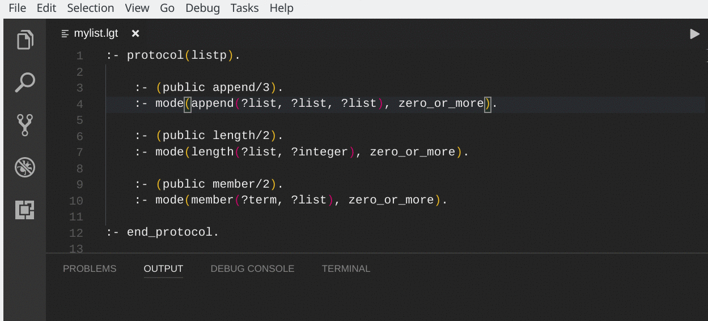

# VSC-Logtalk
A VS Code extension which provides language support for Logtalk.

___________________
  [Features](#features) | [Configurations](#configurations) | [Bug Reporting](https://github.com/arthwang/vsc-logtalk/issues) | [Donation](#donation)
__________________

## Note before installation

This extension can be installed via extensions viewlet of VS Code or 'Extensions: install extension' command from the command palette. The author notices that it is developed and tested in ***logtalk 2.2*** and ***VS Code 1.17*** on ***Debian 9.0*** (stretch). It's not yet tested under other environments.

## Features
  * [Syntax highlighting](#syntax-highlighting)
  * [Snippets](#indentation-snippets-and-auto-completion)
  * [Grammar Linter](#grammar-linter)
  * [Load active source file](#load-active-source-file)

## Feature descriptions and usages
  
### syntax highlighting

  * Prolog like syntax highlighting
  * Built-ins pattern support

### Indentation, snippets and auto-completion

  * Indentation after new line
  * Built-in directive, method and predicate template auto-completion
  * Auto-complete recursive parameters:  When '.'(dot) occures as first non-space character, VSC-Logtalk will repeat the nearest above head of clause and automatically change the parameters if possible.
  
   > Note: Relations between entities use choice snippets. 'orel' triggers object relation choices and 'crel' for category. There is only one relation between protocols 'extends', so 'ext' will trigger the snippet.
   
   > The snippets for built-ins all are triggered by natural prefix, i.e. ':- public' triggers ':- public()' directive. You needn't to type all charaters to show up the suggestion list.

   > Refter to the table below for other snippets:

  | Prefix  | Description | 
  | -------: | ------- |
  |  :- obj | Object|
  |  :- cat | Category|
  |  :- pro | Protocol|
  |  orel | relations between objects(choice)|
  |  crel | relations between categories(choice)|
  |  ext | relations between categories|
  |  category | Category with protocol|
  |  category | Category|
  |  class | Class with all|
  |  class | Class with category|
  |  class | Class with metaclass|
  |  class | Class with protocol|
  |  class | Class|
  |  category | Complementing category|
  |  category | Extended category|
  |  protocol | Extended protocol|
  |  instance | Instance with all|
  |  instance | Instance with category|
  |  instance | Instance with protocol|
  |  instance | Instance|
  |  private | (with no arguments)|
  |  private | Private predicate|
  |  protected | (with no arguments)|
  |  protected | Protected predicate|
  |  protocol | Protocol|
  |  object | Prototype with all|
  |  object | Prototype with category|
  |  object | Prototype with parent|
  |  object | Prototype with protocol|
  |  object | Prototype|
  |  public | (with no arguments)|
  |  public | Public predicate|

  

### Grammar linter
  * The grammar errors (if any) will display in OUTPUT channel when active source file is saved.
  
  * Command 'Goto next/previous error':  This command (default mapping to f7/shift f7) locates the cursor at the nearest line with error/warning from current cursor location and the corresponding error/warning message displays in output channel.

  

### Load active source file

  * Command 'Logtalk: load document' 

    This command can be triggered from command palette or editor context menu (default map to F9). It loads the source file in active editor into logtalk process in the integrated terminal, spawning the logtalk process if run the command firstly. The logtalk process provides a real REPL console. 

  
  
  > You can open Logtalk terminal indepently by 'Logtalk: open logtalk' command.

## Configurations
  
  * The user can configure settings via VS Code menu File/Preferences/Settings.  Entering 'logtalk' in the input box will show up logtalk settings. There are only two settings in this extension with default values:
    * "logtalk.executablePath": "/usr/bin/logtalk",
      This setting points to the Logtalk executable. Use real path to the executable i.e. swilgt.sh if symbolic link doesn't run in VSC-Logtalk.

    * "logtalk.terminal.runtimeArgs": [],
      Arguments of Logtalk executable run in terminal.

## Bug reporting

  Feel free to report bugs or suggestions via [issues](https://github.com/arthwang/vsc-logtalk/issues)

## Contributions

  [Pull requests](https://github.com/arthwang/vsc-logtalk/pulls) are welcome.

## Acknowledgements
  The author of this extension thanks Professor Paulo Moura who is the author of Logtalk for his patient helps and supports. Syntax tmLanguage and some snippets are integrated from his distro of Logtalk.

## License

  [MIT](http://www.opensource.org/licenses/mit-license.php)

## Donation

  >If this extension works well for you, would you please donate a loaf of bread to encourage me, a freelance programmer, to spend more time to improve it. Any amount is greatly appreciated.

   [PayPal](https://paypal.me/ArthurWang9)